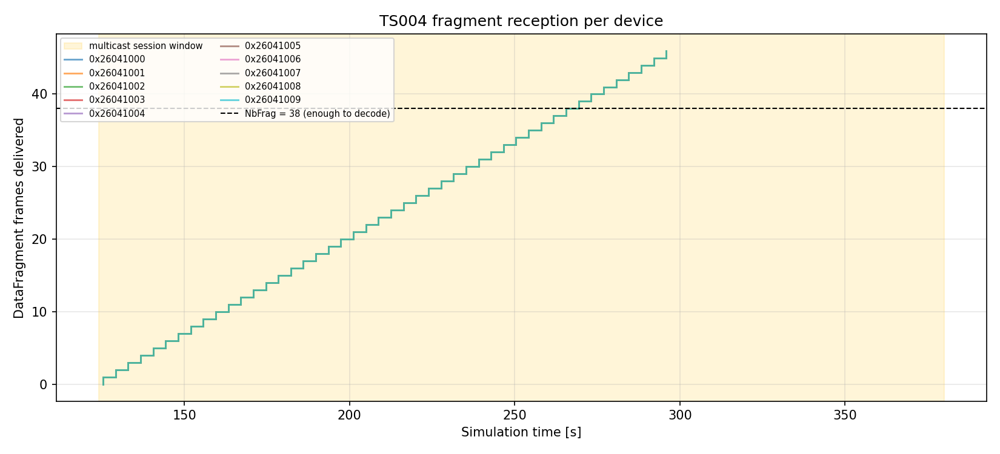
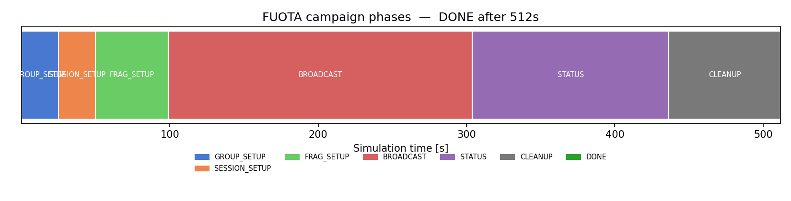
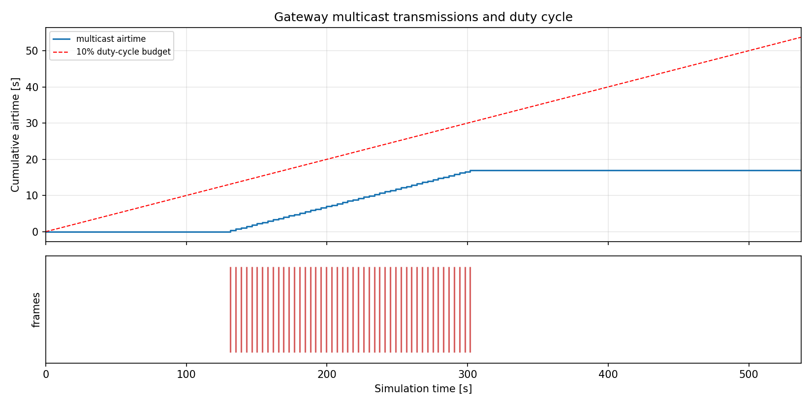
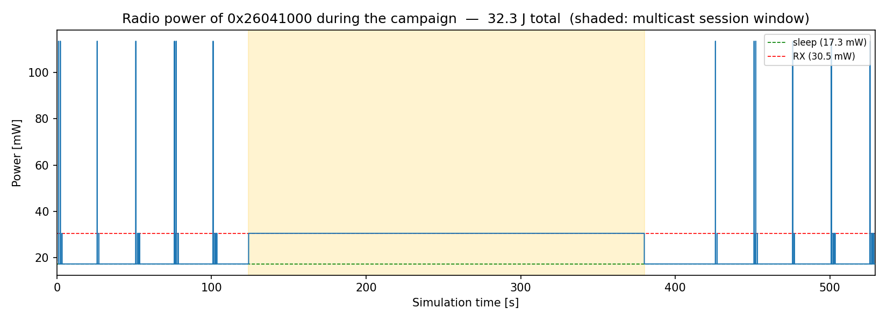

# LoRaWAN FUOTA Example

A complete firmware-update-over-the-air campaign over the **standard LoRa Alliance stack**:
TS003 application clock synchronisation, TS005 Remote Multicast Setup v2.0.0 and TS004
Fragmented Data Block Transport v2.0.0, driven by
[`simulator/lorawan/fuota/`](../../simulator/lorawan/fuota).

A gateway with a 10% duty cycle pushes a firmware image to a fleet of Class A end devices.
Everything really goes on the air: the setup commands only reach a device in the RX1 window
that follows one of its *own* uplinks, the fragments are a genuine multicast broadcast, and a
device that is transmitting while a fragment goes out simply misses it.

| Script | What it does |
| :----- | :----------- |
| `main.py` | The campaign itself, with a CLI for the fleet size, image size, redundancy, losses and Class B/C. |
| `plots.py` | The four figures below. |
| `compare_with_paper.py` | The Malumbres 2024 scenario of `papers/fuota-unicast-broadcast-2024` re-run over this stack. |

## Running

From the repository root:

```bash
pipenv run python examples/lorawan_fuota/main.py                  # the default campaign
pipenv run python examples/lorawan_fuota/main.py --plots          # and write the PNGs
pipenv run python examples/lorawan_fuota/main.py --loss 0.2       # 20% fragment loss, repair rounds kick in
pipenv run python examples/lorawan_fuota/main.py --class-b        # ping-slot session instead of Class C
pipenv run python examples/lorawan_fuota/compare_with_paper.py    # ~1.5 minutes of wall time
```

`main.py` exits non-zero when the campaign does not reach `DONE`. The default run takes under
three seconds of wall time and covers 504 s of simulated time.

## What is simulated, step by step

Three application-layer packages run side by side on every device
([`FuotaDeviceStack`](../../simulator/lorawan/fuota/device_stack.py)), and the matching three
server-side packages are registered on the network server by
[`FuotaCampaign`](../../simulator/lorawan/fuota/campaign.py):

| FPort | Spec | Package |
| ----: | :--- | :------ |
| 200 | TS005 | Remote Multicast Setup |
| 201 | TS004 | Fragmented Data Block Transport |
| 202 | TS003 | Application clock synchronisation |
| 10 | — | The device's own periodic sensor payload, which is what opens the RX windows |

The campaign walks the following state machine; every phase is bounded by a timeout and
carries on with whichever devices answered, so a silent node costs time but never deadlocks
the fleet.

1. **GROUP_SETUP** — `McGroupSetupReq` (TS005 §4.3, CID 0x02) is queued for every device and
   delivered in RX1. It carries `McGroupIDHeader`, `McAddr`, the `McKey_encrypted` (AES-ECB
   under the device's own `McKEKey`, derived from its `GenAppKey`) and the
   `minMcFCnt`/`maxMcFCnt` window. The device derives `McAppSKey`/`McNwkSKey`, creates the
   multicast context and answers `McGroupSetupAns`.
2. **SESSION_SETUP** — `McClassCSessionReq` (TS005 §4.5, CID 0x04) with `SessionTime`,
   a 4-bit `SessionTimeOut` exponent, `DLFreq` and `DR`; or `McClassBSessionReq` (§4.6, CID
   0x05) with `TimeToStart` and `Periodicity` when `--class-b` is given. The device answers
   `McClassC/BSessionAns` and schedules the switch.
3. **FRAG_SETUP** — `FragSessionSetupReq` (TS004 §3.3, CID 0x02): `FragSession` index,
   `NbFrag`, `FragSize`, `Control` (fragmentation algorithm, `BlockAckDelay`,
   `AckReception`), `Padding`, `Descriptor`, `SessionCnt` and a 4-octet MIC over the data
   block computed with the per-device `DataBlockIntKey`. The device allocates memory and
   answers `FragSessionSetupAns`. This phase runs inside the session lead time and ends at
   `SessionTime` at the latest: the order of steps 2 and 3 is the one of TR002 "FUOTA
   Process Summary" Table 3 (rendezvous first, fragmentation session second).
   `FuotaCampaignConfig.session_before_frag_setup=False` swaps them, which is what
   ChirpStack and the Semtech reference code do.
4. **BROADCAST** — at `SessionTime` the devices switch to Class C (continuous RX) or open
   their ping slots, and the gateway transmits `NbFrag + redundancy` `DataFragment` frames
   (TS004 §3.6, CID 0x08) to `McAddr`, paced by its duty cycle. The redundancy frames are
   *coded* fragments: XOR combinations of the data fragments chosen by the PRBS23-driven
   parity matrix of TS004 §A, so any `NbFrag` linearly independent frames reconstruct the
   image — it does not matter *which* ones a device missed.
5. **STATUS** — `FragSessionStatusReq` (§3.2, CID 0x01); the devices answer
   `FragSessionStatusAns` with `NbFragReceived` and `MissingFrag`. A device that already
   reconstructed the block announces it with `FragDataBlockReceivedReq` (§3.5, CID 0x04 —
   the one command the *device* originates), checking the `DataBlockIntKey` MIC of §3.3 as
   it reassembles and setting the `MICError` bit if it does not verify. Such a block "SHALL
   NOT be used": the device stack discards the image instead of storing it, and the campaign
   counts the device as **failed** (`FuotaCampaignResult.mic_errors`), not as complete — no
   number of repair fragments can mend a block that is already fully defragmented. The phase
   waits for the multicast session window to close before its timeout starts counting —
   nothing can be answered while a Class C device is mute — and polls a device that stayed
   silent again (`max_status_rounds`, 2 by default). A device only counts as complete when it
   *said* so, MIC included.
6. **REPAIR** — when the worst-off device still misses *k* fragments the campaign opens a new
   multicast session on the same group and broadcasts `k + 2` further coded fragments,
   continuing the `N` sequence rather than repeating it. Up to `--repair-rounds` times. A
   participant that never reported anything at all counts as *unknown*, not as complete, and
   is worth a round of spare coded fragments on its own.
7. **CLEANUP** — `FragSessionDeleteReq` (§3.4) and `McGroupDeleteReq` (TS005 §4.4).

## Command-line flags

### `main.py`

| Flag | Default | Meaning |
| :--- | :------ | :------ |
| `--devices N` | 10 | End devices, scattered uniformly over a disc around the gateway. |
| `--image-size N` | 8192 | Firmware image in octets. |
| `--redundancy F` | 0.2 | Coded fragments as a fraction of `NbFrag`. |
| `--data-rate N` | 5 | EU868 data rate (DR5 = SF7/125 kHz). |
| `--frag-size N` | *largest that fits* | TS004 `FragSize`; by default the regional maximum application payload minus the 3-octet `DataFragment` header. |
| `--duty-cycle F` | 0.10 | Gateway transmit duty cycle as a fraction; `0` removes the limiter. It is what sets the fragment spacing. |
| `--loss F` | 0.0 | Seeded per-device fragment loss probability, applied to every device (see below). |
| `--repair-rounds N` | 2 | Maximum TS004 repair rounds. |
| `--class-b` | off | Run a TS005 Class B ping-slot session instead of Class C. |
| `--radius M` | 600 | Placement radius in metres. |
| `--seed N` | 1 | Seed for placement, firmware and the loss model. |
| `--sim-length S` | *derived* | Simulation length; derived from the planned campaign when omitted. |
| `--uplink-interval S` | 25 | Seconds between a device's periodic uplinks. **This paces the whole campaign** — see the caveats. |
| `--plots` | off | Write the four PNGs next to this README. |
| `--log-level L` | INFO | `INFO` shows every protocol milestone; `WARNING` shows only the summary. |

`--loss` subclasses `FragmentationDeviceApplication` and discards fragments with a fixed,
seeded probability *after* the LoRaWAN layer accepted them — the same technique
`tests/test_lorawan_fuota_end_to_end.py` uses. It models a node at the edge of coverage
without having to arrange the geometry for it, and keeps the loss pattern identical from run
to run.

### `compare_with_paper.py`

`--nodes`, `--radius`, `--firmware-kb`, `--frag-size`, `--duty-cycle` (in **percent**, like
the paper's own `main.py`), `--redundancy`, `--repair-rounds`, `--exponent`, `--no-fading`,
`--uplink-interval`, `--seed`, `--log-level`.

## What comes out

The default run (10 devices, 8 kB, DR5, 10% duty cycle, 20% redundancy, no losses):

```
  FragSize:           219 octets  ->  NbFrag = 38
  Fragment frame:     235 octets, 368.9 ms on air
  Fragment interval:  3.789 s
...
  Devices complete:     10/10 (10 participant(s), 0 excluded)
  Fragments uncoded:    38
  Fragments coded:      8
  Fragments repair:     0 in 0 repair round(s)
  Multicast frames:     46
  Multicast airtime:    17.0 s
  Duty-cycle quiet:     152.7 s
  Unicast downlinks:    90
  Uplinks received:     80

  Phase durations
    GROUP_SETUP        25.0 s      SESSION_SETUP  25.0 s     FRAG_SETUP     49.0 s
    BROADCAST         205.0 s      STATUS        132.5 s     CLEANUP        75.0 s

  Campaign total time:  511.5 s
  Last device complete: 436.1 s
  Success:              True
```

With `--loss 0.2` the 8 coded fragments are no longer enough, two repair rounds add 14 more,
and all ten devices still finish — 60 fragments scheduled, campaign total 767.5 s. With
`--class-b` the same image goes out through 32 ping slots per 128 s beacon period: 891.5 s,
10/10 complete.

The per-device table reports `dropped` fragments as well. In a lossless run these are the
surplus coded fragments that arrive *after* the device already reconstructed the block —
TS004 §3.6 says a device silently drops anything further on that `FragIndex`.

## The plots

Generated with the defaults by `pipenv run python examples/lorawan_fuota/main.py --plots`.

### Fragment reception per device



One step curve per device, counting `DataFragment` frames delivered to its TS004 package,
with the multicast session window shaded. The dashed line is `NbFrag`: the moment a curve
crosses it the device has enough linearly independent fragments to reconstruct the image.
Without losses all ten curves are identical and lie on top of each other (hence the alpha);
with `--loss` they fan out and the slowest one is what the repair rounds are sized against.

### Campaign phase timeline



`FuotaCampaign.state_history` as a Gantt bar. It makes the cost structure obvious: the
unicast setup and status phases are paced by the devices' uplink interval, the broadcast by
the gateway's duty cycle.

### Gateway transmissions and duty cycle



Cumulative multicast airtime against the `duty_cycle × t` budget line, with every transmitted
frame as a tick below. The airtime curve hugs the budget during the broadcast — the campaign
paces the fragments at exactly `airtime / duty_cycle`, so the duty cycle, not the bit rate, is
what sets the update time. A Class B campaign sends its frames through the gateway's
ping-slot scheduler, which keeps no multicast log, so this figure is empty there.

### Device radio power



The first device's radio power trace. The spikes are uplinks (TX) and the RX1/RX2 windows of a
Class A device; the flat plateau at the RX level across the shaded session window is the price
of Class C — the receiver stays on for the whole `2^SessionTimeOut` seconds, which in this run
is 256 s for a 198 s broadcast.

## Simplifications and assumptions of this baseline

- **Single channel.** The LoRaWAN layer in this simulator is effectively single-channel.
  `DLFreq` is carried in `McClassC/BSessionReq`, stored and honoured by the device, but it has
  to name the gateway's own channel (868.1 MHz here) or the session would simply never be
  heard. There is no channel hopping and no separate RX2 frequency.
- **Simulation time is GPS time.** TS005 `SessionTime` is GPS seconds. The device has no GPS
  clock, so `sim.current_time()` *is* the GPS timebase, which is also what the TS003 server
  package assumes. The clock-sync exchange therefore always reports an offset of 0; it is
  there because a real FUOTA device needs it, not because it corrects anything here.
- **No TS006 Firmware Management.** The campaign delivers and verifies a data block. There is
  no `DevVersionReq`, no firmware upgrade image management and no reboot — "the device holds
  the image" is where this baseline stops.
- **MIC over the un-padded block.** TS004 §3.3's `MIC` is computed over the data block as
  handed to the campaign, not over the padded multiple of `FragSize`.
- **Duty-cycle model.** `LoRaWanGateway`'s `DutyCycleLimiter` is the usual simple rule: after
  a frame of `ToA` seconds the transmitter stays quiet for `ToA × (1/d − 1)`. It is a
  per-transmitter budget on one sub-band — there is no per-sub-band accounting, and the end
  devices have no duty-cycle limit at all.
- **One downlink per uplink.** The network server returns at most one downlink per uplink and
  round-robins between the registered packages. The gateway is a single transceiver: it keeps
  *receiving* while it waits out a device's `RECEIVE_DELAY1`, so no uplink is lost, but when
  two RX1 windows fall on top of each other the later reply is skipped rather than transmitted
  into a window that has already closed. Both server packages therefore keep a unicast command
  **in flight** until its answer arrives and retransmit it on the device's next uplink (up to
  `command_retries`, 3 by default), which is what makes a dense fleet converge. Staggering the
  fleet — the example spaces the devices' first uplinks one `--uplink-interval / --devices`
  apart — is no longer required for correctness; it is simply a sensible default that avoids
  paying for those retransmissions.
- **Class C uplink blackout.** A device in a Class C multicast session does not transmit, and
  `FuotaDeviceStack` skips one further slot while it hands the radio back. Because the TS005
  `SessionTimeOut` is a power of two, the window can overrun the broadcast by almost as much
  again — in the default run the broadcast ends at ~300 s but the window only closes at 381 s.
  Nothing can be acknowledged in between, which is why the campaign only starts counting a
  status phase's timeout once the window has closed and the devices have had a couple of
  uplink opportunities (`FuotaCampaign.answers_possible_at`), and why the TS004 §3.5
  `FragDataBlockReceivedReq` retry counts *transmissions* rather than elapsed time. A clean
  run produces no warnings.
- **Class B caveats** (from `FuotaCampaign`/`FuotaDeviceStack`): `SessionTime` is rounded up
  to a whole beacon period and `TimeOut` counts beacon periods, not seconds. A Class B device
  spends its time waiting for beacons and ping slots, which makes the RX1 window after an
  uplink a far less reliable place to deliver a unicast command — so the devices do the whole
  TS005/TS004 handshake in Class A, switch to Class B one and a half beacon periods before
  `SessionTime` (enough to guarantee beacon lock) and drop back to Class A once the window has
  closed. Class B multicast frames go out through the gateway's ping-slot scheduler, which
  keeps no `multicast_log`, so `FuotaCampaignResult.multicast_frames` stays 0 there and
  `fragments_scheduled` is the figure to read.
- **Reproducibility.** Placement, firmware and the loss model are seeded; the channel is
  log-distance with no shadowing (`sigma = 0`). `compare_with_paper.py` adds Nakagami fading,
  which draws from Python's *global* `random`, so it seeds that too.

## Comparing with the paper implementation

`papers/fuota-unicast-broadcast-2024` reproduces Malumbres et al., *Sensors* 2024, 24, 2104,
which distributes firmware over **raw LoRa with MiWi frames and no LoRaWAN at all**, repairing
with per-node bitmaps and acknowledged unicast. `compare_with_paper.py` sets up the same radio
scenario and runs the standard LoRaWAN campaign over it. Nothing is imported from `papers/` —
the parameters are restated in the script.

Run both and put the headline numbers side by side:

```bash
pipenv run python papers/fuota-unicast-broadcast-2024/main.py --method broadcast_unicast --nodes 10 --radius 400
pipenv run python examples/lorawan_fuota/compare_with_paper.py
```

Mirrored from Table 1 and Figure 6: 10 nodes uniform **in distance** over a 400 m radius,
100,000 octets of firmware, SF7 / 125 kHz / CR 4/5, 14 dBm, −125 dBm sensitivity,
log-distance path loss with exponent 3.2 plus Nakagami fading, 1% duty cycle, and the paper's
192-octet chunk as TS004's `FragSize` — which cuts the image into the same **521 fragments**.

Result of the default run (seed 0):

| Metric | This stack (TS003/TS005/TS004) | Paper, broadcast + unicast | Paper, broadcast only |
| :----- | -----------------------------: | -------------------------: | --------------------: |
| Last node holds the binary | **4.96 h** | 4.66 h | 4.87 h |
| Broadcast stage | 5.09 h | 4.47 h | — |
| Nodes updated | 10/10 | 10/10 | 10/10 |
| Multicast frames | 548 (521 + 27 coded) | 521 per round + repairs | 521 per round + repairs |

The two land within ~6% of each other, which is the expected answer: at 1% duty cycle the
update time is `total airtime / duty cycle` and almost nothing else. The residual difference
is frame overhead — a LoRaWAN `DataFragment` carrying 192 octets is 208 octets on the air
(3 octets of TS004 header plus 13 of LoRaWAN frame) against the paper's 196-197.

What could **not** be mirrored:

- **Frame layout.** The paper's 215-octet MiWi frame has no LoRaWAN equivalent. `FragSize` is
  set to the paper's 192-octet chunk so the fragment *count* matches exactly; the frames are
  11–12 octets longer.
- **The duty-cycle model.** The paper applies the 1% quiet time to the whole *medium* after
  every frame, acknowledgements included (its section 4). `DutyCycleLimiter` is a
  per-transmitter budget, which is what the regulations actually require. For the broadcast
  stage the two agree, because only the gateway transmits; for the paper's unicast repair
  stage they do not, which is one reason its *unicast only* figure is so much larger.
- **The repair mechanism.** Bitmap-driven ARQ against TS004 coded fragments. These are
  genuinely different protocols — TS004 never learns *which* fragments a device missed, only
  how many, and sends that many more parity fragments to the whole group. The comparison is of
  the resulting update time, not of the mechanism. `--redundancy 0` is the closest analogue to
  the paper's "no FEC"; anything above it is the TS004 advantage.
- **Checksum, flashing, reboot.** Sections 3.1(d)/(e) of the paper have no counterpart here —
  that is TS006 Firmware Management. The metric compared is therefore the paper's *binary
  exchange* time.
- **The unicast setup and status phases.** The paper's protocol has no periodic uplink and no
  network server; the LoRaWAN campaign's setup, status and cleanup phases are paced by the
  devices' own uplinks, which adds a few minutes that have no equivalent in the paper. They
  are a rounding error next to five hours of duty-cycle-limited broadcast.
- **"Last node holds the binary" is measured on the devices.** The campaign's own
  `last_completion_time` is when the *network server* learned of it, which — because a Class C
  device cannot transmit while the session window is open — is several hours later. The script
  prints both.
